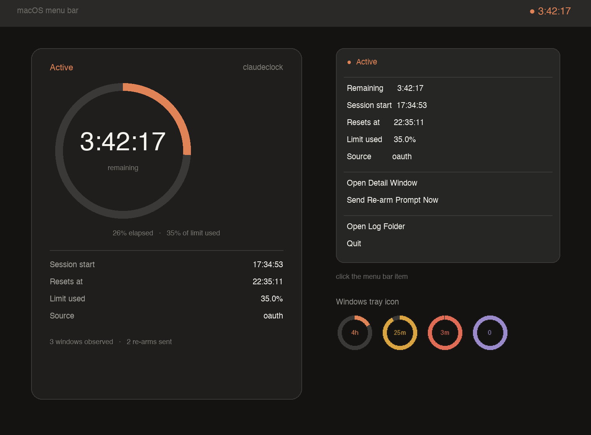

# ClaudeClock

A live countdown of your Claude **5-hour usage window**, in the macOS menu bar
and the Windows taskbar.

When the window runs out, ClaudeClock sends a single tiny prompt (`"Hi"`) to
open the next one, so your next session is always ready.



**[Download for macOS (.dmg)](../../releases/latest)** ·
**[Download for Windows (.exe)](../../releases/latest)**

---

## What it does

- Shows the exact time left in your current 5-hour window, ticking every second.
- Reads the real reset time from Anthropic's own usage endpoint — not a guess.
- Warns you at 30, 10, and 5 minutes remaining (desktop notification, plus
  optional Discord/Slack/webhook).
- When the window ends, sends `"Hi"` through the Claude Code CLI to start the
  next window, then tracks that one. Repeats indefinitely.
- Logs every reset, prompt sent, and session start to `~/.claudeclock/events.jsonl`.

Colours tell you the state at a glance: terracotta while you have time, amber
under 30 minutes, red under 5, purple once the window has lapsed.

---

## Where the data comes from

| Source | What it is | Accuracy |
|---|---|---|
| `oauth` | `GET https://api.anthropic.com/api/oauth/usage` — the same endpoint Claude Code's own `/usage` screen uses, authenticated with the token already on your machine | exact |
| `statusline` | The Claude Code `statusLine` hook, which reports `rate_limits.five_hour` | exact, but only while Claude Code is open |
| `local` | Inferred from Claude Code's local transcript timestamps | approximate, fallback only |

The first one that answers wins, and the app always labels which one it used.
A 5-hour window starts on your *first request* after the last one ended — which
is why the app sends `"Hi"` to open a new one rather than waiting.

---

## Setup

### 1. Install Claude Code

ClaudeClock needs the `claude` CLI to send the re-arm prompt.

**macOS / Linux**

```bash
curl -fsSL https://claude.ai/install.sh | bash
```

**Windows (PowerShell)**

```powershell
irm https://claude.ai/install.ps1 | iex
```

Then sign in — this is what gives ClaudeClock access to your usage data:

```bash
claude
```

Type `/login` if it does not prompt you automatically, and follow the browser
flow. Confirm it worked:

```bash
claude --version
```

### 2. Install ClaudeClock

**macOS**

1. Download `ClaudeClock-1.0.0.dmg` from [Releases](../../releases/latest).
2. Open it and drag **ClaudeClock** into Applications.
3. Launch it from Applications.
4. macOS will say the developer is unidentified — right-click the app, choose
   **Open**, then confirm. This is only needed once.

**Windows**

1. Download `ClaudeClock.exe` from [Releases](../../releases/latest).
2. Run it. SmartScreen will warn on first run — choose **More info → Run anyway**.

That's it. Look at the **top-right of your screen** (macOS menu bar) or the
**system tray** (Windows). There is no Dock icon by design.

### 3. Check it is working

```bash
claude --version
```

If you also want the command line tools, install from source:

```bash
git clone https://github.com/iamroyce007/claudeclock.git
cd claudeclock
python3 -m venv .venv && source .venv/bin/activate
pip install -e ".[gui]"
cclock check
```

`cclock check` verifies your login, hits the usage endpoint once, and confirms
the `claude` command can be found:

```
Credentials       OK  keychain, plan=pro
Usage endpoint    OK  window resets 2026-07-31 22:10:00, 40.0% used
Re-arm command    OK  /Users/you/.local/bin/claude -p Hi --output-format json
Notifications     OK  desktop
```

---

## Commands

Only needed if you installed from source; the app needs none of these.

```bash
cclock tray            # menu bar / taskbar app
cclock panel           # just the detail window
cclock status          # print the current window and exit
cclock status --json   # machine-readable
cclock check           # diagnose login, endpoint, and re-arm command
cclock log --tail 20   # every reset and prompt sent
cclock trigger         # send the "Hi" prompt right now
```

---

## Configuration

Optional. Copy `.env.example` to `.env` and edit.

| Setting | Default | What it does |
|---|---|---|
| `CLAUDECLOCK_AUTO_TRIGGER` | `true` | send `"Hi"` when the window ends |
| `CLAUDECLOCK_TRIGGER_PROMPT` | `Hi` | what gets sent |
| `CLAUDECLOCK_TRIGGER_MODEL` | `claude-haiku-4-5-20251001` | cheapest model |
| `CLAUDECLOCK_ALERT_THRESHOLDS` | `30,10,5` | minutes-remaining warnings |
| `CLAUDECLOCK_POLL_INTERVAL` | `60` | seconds between checks |
| `CLAUDECLOCK_THEME` | `dark` | `dark`, `light`, or `auto` |
| `CLAUDECLOCK_DISCORD_WEBHOOK_URL` | — | optional |
| `CLAUDECLOCK_SLACK_WEBHOOK_URL` | — | optional |

Logs and state live in `~/.claudeclock/`.

---

## Start it at login

- **macOS** — System Settings → General → Login Items → add ClaudeClock.
- **Windows** — put a shortcut to `ClaudeClock.exe` in `shell:startup`.

---

## Authors

- **[@iamroyce007](https://github.com/iamroyce007)** — author and maintainer
- Built with [Claude Code](https://claude.com/claude-code)

## License

MIT
